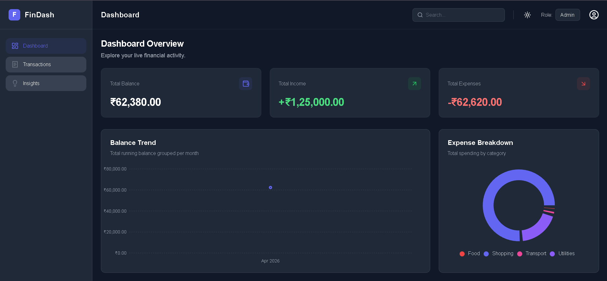
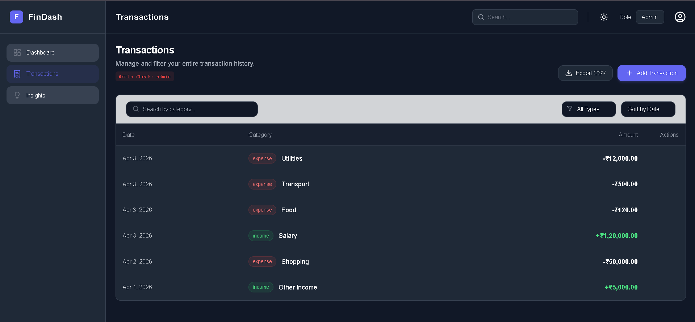
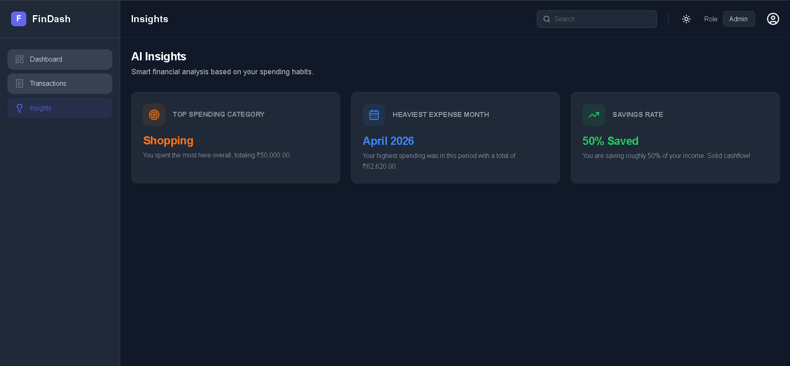

# 💰 Financial Dashboard

## 🌐 Live Demo

[🔗 View Live Application](https://zorvyn-bay.vercel.app/)

A modern, responsive financial dashboard built using React that helps users track transactions, analyze spending patterns, and gain meaningful financial insights through interactive visualizations.

---

# 🚀 Features

* 📊 **Dashboard Overview**

  * Total Balance, Income, and Expenses
  * Interactive charts (Line + Pie)

* 📋 **Transactions Management**

  * Add, edit, and delete transactions
  * Search, filter, and sort functionality

* 🔐 **Role-Based UI**

  * Viewer → Read-only access
  * Admin → Full CRUD access
  * UI and logic both protected

* 💡 **Insights**

  * Highest spending category
  * Monthly expense trends
  * Income vs Expense comparison

* 🌙 **Dark Mode**

  * Toggle between dark and light themes

* 📤 **Export**

  * Download transactions as CSV

* 🎬 **Animations**

  * Smooth UI transitions using Framer Motion

* 📱 **Responsive Design**

  * Works across mobile, tablet, and desktop

* ⚡ **UX Enhancements**

  * Loading states
  * Empty states
  * Clean, modern UI

---

# 🛠️ Tech Stack

* **Frontend:** React (Vite)
* **Styling:** Tailwind CSS
* **State Management:** Zustand
* **Charts:** Recharts
* **Animations:** Framer Motion

---

# 📂 Project Structure

```
src/
├── components/    # Reusable UI components
├── pages/         # Dashboard, Transactions, Insights
├── store/         # Zustand state management
├── data/          # Mock data
├── utils/         # Helper functions
```

---

# ⚙️ Setup Instructions

```bash
npm install
npm run dev
```

---

# 🔐 Role-Based Access

This project simulates a real-world role-based system:

* **Viewer**

  * Can view all data
  * Cannot modify anything

* **Admin**

  * Can add, edit, and delete transactions

Both **UI-level restrictions** and **state-level checks** are implemented to ensure proper access control.

---

# 💡 Insights Engine

The application analyzes transaction data to generate insights such as:

* Top spending category
* Highest expense month
* Savings comparison (Income vs Expense)

---

# 📤 Export Feature

Users can export transaction data as a **CSV file**, making it easy to use outside the application.

---

# 🎨 UI / UX

* Clean and modern dashboard layout
* Dark mode support
* Responsive across devices
* Smooth animations for better interaction

---

# 📸 Screenshots

## 📊 Dashboard & Transactions

<p align="center">
  
  
</p>

---

## 💡 Insights

<p align="center">
  
</p>

---

# 🧠 Learning Outcomes

* Managing global state using Zustand
* Designing scalable component architecture
* Implementing role-based UI (RBAC)
* Building data visualizations
* Improving UX with loading & empty states
* Structuring a real-world frontend project

---

# 🤖 Use of AI in Development

AI tools were used selectively during the development of this project to improve productivity and explore better implementation approaches.

Specifically, AI assisted in:

* Structuring the project architecture
* Refining UI/UX decisions
* Debugging setup issues (e.g., Tailwind configuration)
* Generating and improving component logic

All features, integrations, and final decisions were **reviewed, implemented, and understood manually** to ensure correctness and learning.

This reflects a practical approach to modern development, where AI is used as a **support tool, not a replacement for understanding**.

---

# 📌 Conclusion

This project demonstrates the ability to build a complete, scalable, and user-friendly financial dashboard with modern frontend technologies and best practices.
